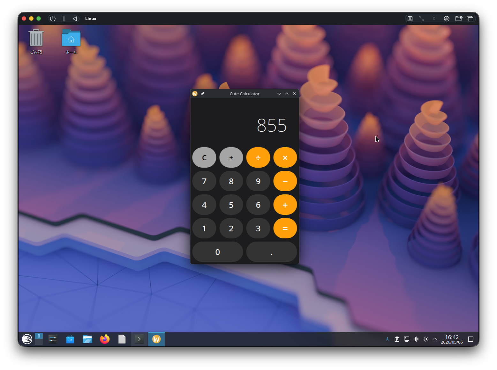

# Cute

A general-purpose programming language **dedicated to the Qt 6 /
KDE Frameworks ecosystem** — first-class properties, signals,
slots, reactive bindings, and direct QObject codegen with no
`moc` step.

> _**Note:** Cute is an independent, community-developed project.
> It is not affiliated with, endorsed by, or sponsored by The Qt
> Company / Qt Group, the Qt Project, or KDE e.V. "Qt" is a
> trademark of The Qt Company; "KDE" / "Plasma" / "Kirigami" are
> trademarks of KDE e.V._



*[`examples/calculator`](examples/calculator/) running natively on
KDE Plasma 6. One `.cute` file: model class + style blocks +
widget tree.*

## 📚 Documentation

**→ Full docs, tutorial, and reference: [i2y.github.io/cute](https://i2y.github.io/cute/)**

- [Installation](https://i2y.github.io/cute/installation/) — get `cute` on your `PATH` (macOS / Linux)
- [Anatomy of a Cute app](https://i2y.github.io/cute/anatomy/) — walkthrough of `examples/calculator`
- [App targets](https://i2y.github.io/cute/targets/) — QML / QtWidgets / GPU canvas / HTTP server / CLI
- [Toolchain](https://i2y.github.io/cute/toolchain/) — `cute build` / `check` / `test` / `fmt` / `watch` / `cute-lsp`
- [Language tour](https://i2y.github.io/cute/tour/) — every language feature
- [Reference](https://i2y.github.io/cute/reference/) — memory model, C++ interop, asset embedding, library sharing

## Quick start

```sh
git clone https://github.com/i2y/cute && cd cute
just install                         # → ~/.cargo/bin/cute
cute build examples/counter/counter.cute && ./examples/counter/counter
```

See [Installation](https://i2y.github.io/cute/installation/) for
full prerequisites + per-OS Qt 6 setup.

## Repository layout

- `crates/` — Rust compiler crates (`cute-syntax` / `cute-hir` / `cute-types` / `cute-codegen` / `cute-cli` / `cute-lsp` / …)
- `runtime/cpp/` — header-only C++ runtime (`cute::Arc`, `Result`, str format, async)
- `runtime/cute-ui/` — Qt 6.11 Canvas Painter UI runtime (`gpu_app`)
- `stdlib/qt/` — bundled `.qpi` bindings (QObject / QtWidgets / QtQuick / QHttpServer / …)
- `extensions/` — `vscode-cute`, `kate-cute`, `cute-pygments`
- `examples/` — 60+ working `.cute` demo projects
- `website/` — Zensical docs site source
- `docs/` — dev-facing specs (`CPP_INTEROP.md`, `CUTE_UI.md`)

## Project status

**Alpha — daily-usable on macOS + recent Linux with Qt 6.11.** The
compiler interface (`.cute` syntax, `cute.toml` manifest, generated
C++ shape) is not yet stable; breaking changes can land between
commits while we converge on v1.0.

## License

Cute itself is **`MIT OR Apache-2.0`** (dual-licensed). See
[`LICENSE`](LICENSE).

Binaries built with Cute link to Qt 6 and inherit Qt's license:
LGPL v3 for open-source Qt (most distros, Homebrew, KDE Neon),
GPL v3 for certain modules (e.g. Qt 3D in some configs), no
open-source obligations under commercial Qt. Cute defaults to
dynamic linking via CMake, so the LGPL path Just Works for
typical KDE / Linux desktop / Qt mobile / server setups.

## Trademarks

Cute is an independent, community-developed open-source project.
It is not affiliated with, endorsed by, or sponsored by:

- **The Qt Company / Qt Group** — owner of the "Qt" trademark
- **The Qt Project** — Qt's open-source community
- **KDE e.V.** — owner of the "KDE", "Plasma", "Kirigami", and
  "KDE Frameworks" trademarks

References to Qt, KDE, Kirigami, and Plasma in this documentation
describe the runtime libraries Cute targets and do not imply any
commercial relationship. All other trademarks are the property of
their respective owners.
